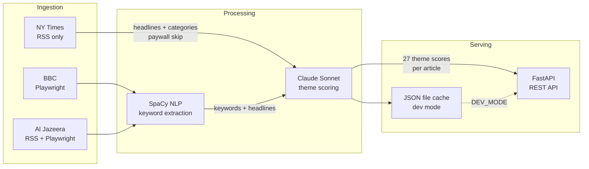

# Zeitgeist Processor

The data pipeline behind the [Zeitgeist Engine](https://github.com/Abdeeezy/zeitgeist-frontend). Scrapes top stories from major news outlets, extracts keywords via NLP, scores each article against 27 thematic concepts using an LLM, and serves the results as a REST API that feeds a GPU-accelerated particle simulation.

## What it does

Every run of the pipeline answers one question: *what is the news "about" right now - not in terms of topics, but in terms of human themes?*

An article about a ceasefire might score high on **Renewal** and **Unity**. A piece on government surveillance scores toward **Control** and **Erosion**. These scores become particle spawn counts in the simulation - the more an article resonates with a theme, the more particles of that type appear. Over time, the simulation becomes a living, abstract portrait of the news cycle.

## Pipeline Architecture



### Stage breakdown

**1. Ingestion** (`app/ingestion/media_reading.py`)
Fetches current top stories from three sources. BBC and Al Jazeera are scraped with Playwright (dynamic rendering), article content is extracted in full. NY Times is RSS-only - their paywall blocks content, but the feed supplies headlines and category tags which are enough for the LLM to work with.

**2. Preprocessing** (`app/processing/text_processing.py`)
Uses SpaCy (`en_core_web_sm`) to extract keywords from article text. Headlines are weighted 3x (repeated before concatenation) since they're editorially crafted to capture the core theme. The pipeline extracts lemmatized nouns and proper nouns, filtering out stop words and punctuation.

**3. LLM Theme Scoring** (`app/processing/LLM_theme_deriver.py`)
Sends articles to Claude in batches (default 5 per request). Each article is scored 0.0-1.0 against 27 thematic concepts organized into a moral taxonomy:

| Alignment | Groups | Themes |
|-----------|--------|--------|
| **Good** | Hope, Love, Generosity | Renewal, Aspiration, Resilience, Compassion, Unity, Devotion, Abundance, Sacrifice, Sharing |
| **Neutral** | Balance, Change, Mystery | Equilibrium, Moderation, Cyclical, Transformation, Adaptation, Flow, Unknown, Potentia, Ambiguity |
| **Evil** | Decay, Domination, Isolation | Entropy, Corruption, Erosion, Control, Subjugation, Tyranny, Separation, Void, Desolation |

**4. Serving** (`main.py`)
FastAPI serves the scored data. Results are cached in memory for the lifetime of the server process - the pipeline only runs once per server start (or on-demand via the wipe endpoint).

## Project Structure

```
zeitgeist-processor/
├── main.py                          # FastAPI app + pipeline orchestration
├── app/
│   ├── ingestion/
│   │   └── media_reading.py         # Web scrapers (BBC, Al Jazeera, NYT)
│   ├── models/
│   │   ├── ArticleDataModel.py      # Article dataclass
│   │   └── NewsSiteDataModel.py     # NewsCollection dataclass
│   ├── processing/
│   │   ├── text_processing.py       # SpaCy keyword extraction
│   │   └── LLM_theme_deriver.py     # Claude API theme scoring
│   └── storage/
│       └── trivial_file_storing.py  # JSON file cache (dev mode)
├── .env                             # API keys (not committed)
└── requirements.txt
```

## Setup

### Prerequisites

- Python 3.11+
- An [Anthropic API key](https://console.anthropic.com/)

### Installation

```bash
git clone https://github.com/Abdeeezy/zeitgeist-processor.git
cd zeitgeist-processor

#create a virtualEnv (if you want to isolate the install libraries) 
python3 -m venv myenv
#activate it
source myenv/bin/activate #linux

pip install -r requirements.txt

# SpaCy language model
python -m spacy download en_core_web_sm

# Playwright browsers (for BBC + Al Jazeera scraping)
playwright install chromium
```

### Environment Variables

Create a `.env` file in the project root:

```env
ANTHROPIC_API_KEY=sk-ant-...

ZEITGEIST_DEV = 'true' # enables development mode which makes use of cached data-files to speed up development; 
```

### Running

```bash
# Production - runs the full scrape + LLM pipeline on first request
uvicorn main:app --reload

# Dev mode - loads from cached JSON files if available, skips scraping + LLM
ZEITGEIST_DEV=true uvicorn main:app --reload
```

The server starts at `http://127.0.0.1:8000`.

## API Endpoints

### `GET /api/data`

Returns all processed articles with their keywords and theme scores. Triggers the pipeline on first call if data isn't already cached in memory.

**Example response:**

```json
[
  {
    "headline": "BBC ->>- Global leaders agree on new climate framework",
    "keywords": ["leader", "climate", "framework", "agreement", "emission", "nation", "target"],
    "themeScores": {
      "Renewal": 0.7,
      "Aspiration": 0.6,
      "Resilience": 0.3,
      "Compassion": 0.2,
      "Unity": 0.8,
      "Devotion": 0.1,
      "Abundance": 0.2,
      "Sacrifice": 0.4,
      "Sharing": 0.3,
      "Equilibrium": 0.5,
      "Moderation": 0.4,
      "Cyclical": 0.2,
      "Transformation": 0.6,
      "Adaptation": 0.7,
      "Flow": 0.2,
      "Unknown": 0.1,
      "Potentia": 0.3,
      "Ambiguity": 0.2,
      "Entropy": 0.1,
      "Corruption": 0.1,
      "Erosion": 0.3,
      "Control": 0.4,
      "Subjugation": 0.1,
      "Tyranny": 0.1,
      "Separation": 0.1,
      "Void": 0.0,
      "Desolation": 0.1
    }
  },
  {...},
]
```

### `POST /api/wipeAndProcessAnew`

Deletes cached JSON files, re-runs the full pipeline, and returns the new data. Use this when the server has been running and you want fresh articles.

### `GET /api/isOnline`

Health check. Returns `{"status": true}`. Used by the Zeitgeist Engine front-end to show server connectivity status.

## Cost Estimates

The LLM scoring step is the only part that costs money. Costs depend on how many articles are scraped per run.

| Component | Model | Estimated cost per run |
|-----------|-------|----------------------|
| Theme scoring | Claude Sonnet 4.5 | ~$0.04 per batch of 5 articles |
| Typical full run | ~100 articles | **~$0.30-0.40 total** |

Each batch uses up to ~3,000 tokens. With a 15-second delay between batches for rate limiting, a full pipeline run takes roughly 2-3 minutes.

The dev mode cache (`ZEITGEIST_DEV=true`) exists specifically to avoid re-running the LLM during development - once you've done one full run, subsequent starts load from the JSON files at zero cost.

## Dependencies

|    Package      | Purpose |
|-----------------|---------------------------------------------------------|
| `fastapi`       | REST API server                                         |
| `uvicorn`       | ASGI server                                             |   
| `anthropic`     | Claude API client                                       |
| `python-dotenv` | `.env` file loading                                     |
| `spacy`         | NLP preprocessing + keyword extraction                  |
| `feedparser`    | RSS feed parsing (Al Jazeera, NYT)                      |
| `requests`      | HTTP requests                                           |
| `playwright`    | Headless browser for dynamic scraping (BBC, Al Jazeera) |

## License

MIT
